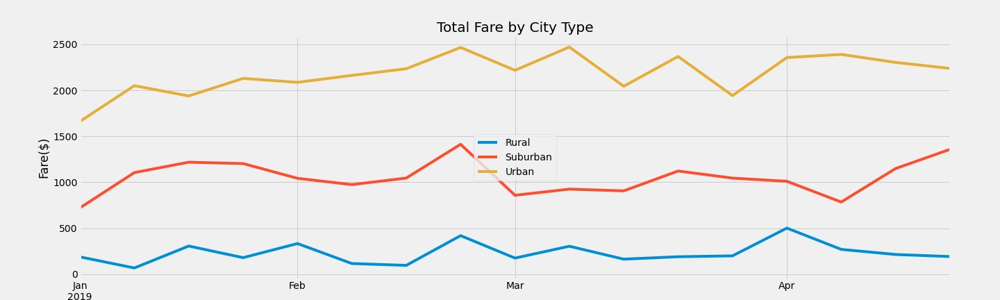

# PyBer_Analysis
Analyzing ride share data 

## Analysis Overview and Purpose

PyBer CEO V. Isualize wants a summary analysis of PyBer ride sharing data. The data compares:

- total drivers
- total rides
- total fares
- average fare per ride
- average fare per driver

by type of city (urban, suburban, and rural).

## Results

There are 13 times fewer rides in rural city areas and 2.6 times fewer rides in suburban city areas as compared to urban city areas.

There are approximately 30 times fewer rural city drivers and 5 times fewer suburban city drivers in comparison to urban drivers.

There are over 9 fewer less total fares in rural areas and over 2 times fewer total fares in suburban areas compared to urban areas.

The average cost per ride is approximately 1.4 times higher in rural areas and 1.2 times higher in suburban areas in comparison to urban areas.

The average fare per driver is approximately 3.4 times higher in rural areas and 2.4 times higher in suburban areas compared to urban areas.

## Summary

There appears to be an oversaturation of urban drivers as well as an undersaturation of rural and possibly suburban drivers. There are far fewer rides per driver in urban areas compared to suburban areas. The fare price per driver in urban areas is lower than suburban areas and far lower than rural areas.

### Business Recommendation #1

Increase the number of drivers in rural and possibly suburban areas. This will decrease fare price and increase interest in using PyBer ride share service. It may also decrease time from a person booking a ride to the ride arriving for pickup, increasing speed and customer appreciation of service.

### Business Recommendation #2

Decrease the number of urban drivers. To potentially avoid ugly layoffs, develop a plan to have urban drivers move their service area to nearby suburban or rural areas. This can be encouraged as well by showing the comparison of fare prices between city types.

### Business Recommendation #3

Decrease the fare price of rides in rural and suburban areas while increasing fare price in urban areas. This may or may not be necessary since increasingly urban cities may have shorter rides compared to more rural regions, which would decrease fare price. However, the average fare per ride shows urban areas cost less for every trip compared to suburban and rural areas.
